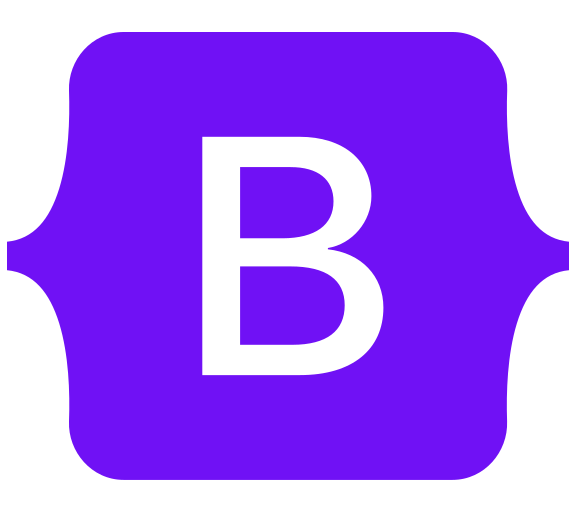

### Hi there I'm Kanyshai Osmonova
- 👀 I’m interested in coding
- 🌱 I’m currently learning Frontend Development
- 👯 I’m looking to collaborate on Open Source Projects
- 🤔 I’m looking for help with Frontend Frameworks
- 📫 How to reach me:   

 
<h3 align="left">Languages and Tools:</h3>

<!--
  
  
 <a href="https://www.cprogramming.com/" target="_blank" rel="noreferrer"> 
 
-->
 
 

